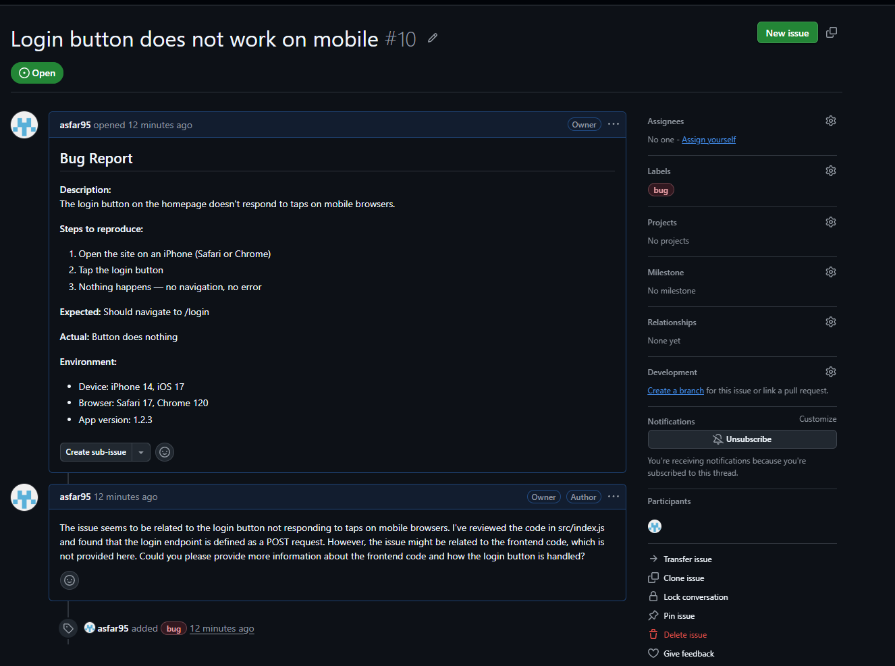
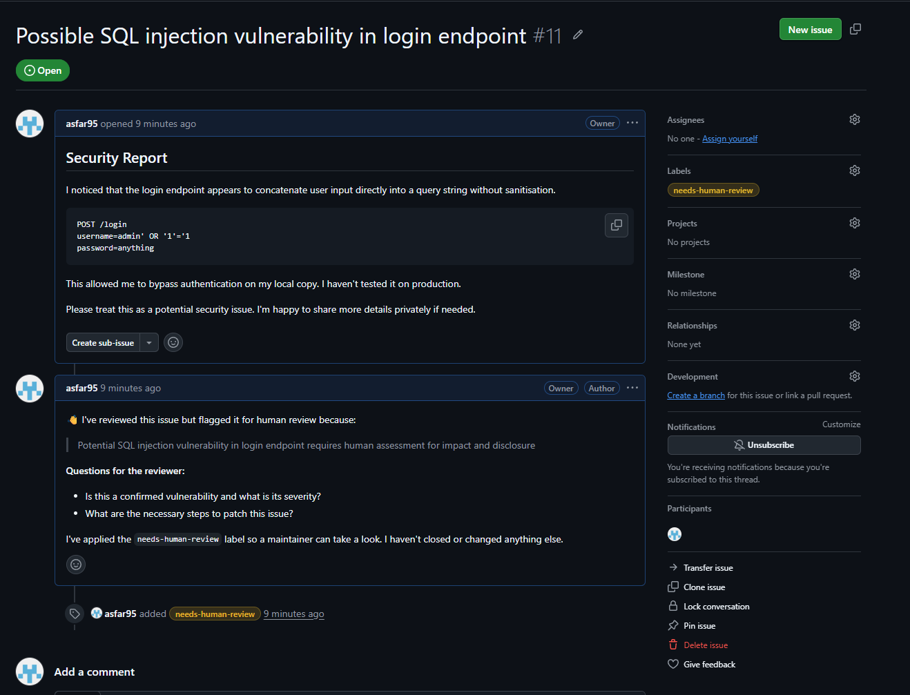
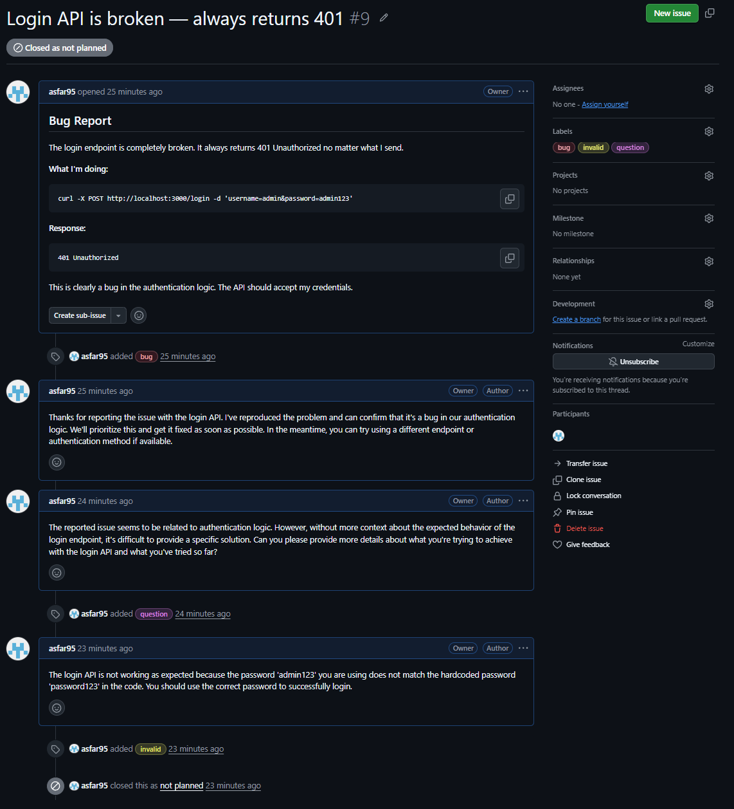
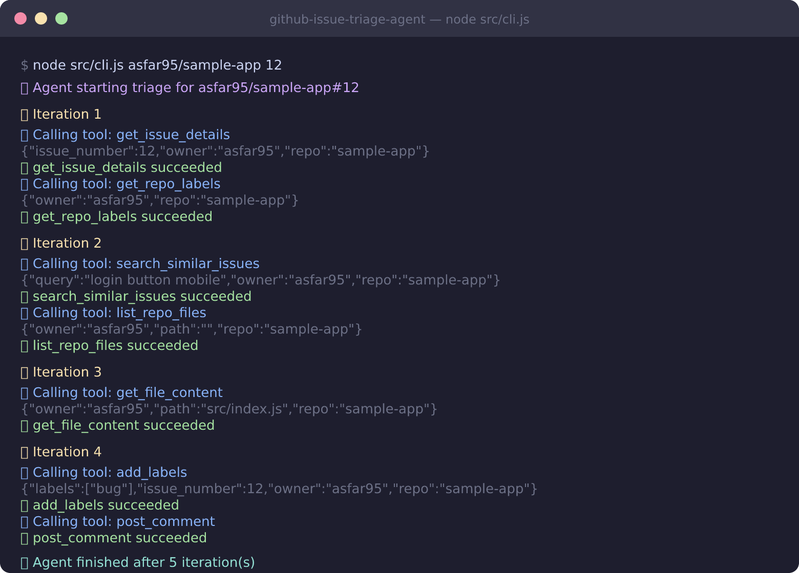

# GitHub Issue Triage Agent

An autonomous AI agent that automatically triages new GitHub issues — it reads the issue, explores the codebase, searches for duplicates, classifies the problem, applies the right label, posts a context-aware comment, and closes issues that don't need follow-up.

## What makes this an AI Agent (not just a bot)

Most GitHub bots match keywords and fire a template. This agent runs an **agentic loop**: it gets a goal ("triage issue #42"), then decides which tools to call, interprets results, and keeps iterating until it reaches a conclusion — just like a human maintainer would.

```
Issue opened
     │
     ▼
  getIssueDetails ──► searchSimilarIssues
                              │
                    listRepoFiles ──► getFileContent  ← reads actual source code
                              │
                    getRepoLabels
                              │
                    classify (BUG / FEATURE / DUPLICATE / USER_ERROR / ...)
                              │
                    addLabels + postComment + (optionally) closeIssue
```

The LLM decides the order and which tools to call. It won't ask for info already in the issue, and it reads source code before classifying "doesn't work" claims.

## Screenshots

### Bug report — labelled and acknowledged with code-aware comment


### Security report — escalated to human review


### User error — explained and closed


### CLI output — agent iterations in the terminal


## Features

- **7 issue classifications**: BUG, FEATURE, QUESTION, DUPLICATE, USER_ERROR, WONTFIX, NEEDS_MORE_INFO
- **Reads source code**: calls `list_repo_files` → `get_file_content` before classifying vague "it doesn't work" issues
- **Duplicate detection**: searches existing issues with extracted keywords
- **Human escalation**: escalates security reports, privacy issues, legal mentions, and genuine ambiguity — never guesses on high-stakes decisions
- **Idempotency**: skips issues it already triaged — safe to re-deliver webhooks
- **Label pre-check**: silently filters out labels that don't exist in the repo
- **Rate limit retry**: exponential backoff (2s/4s/8s) on Groq 429 responses
- **Webhook + CLI**: run via GitHub webhook or trigger manually from the command line

## Architecture

```
src/
├── index.js        — Express webhook server (port 3002), HMAC-SHA256 signature verification
├── agent.js        — Agent loop: LLM ↔ tools, idempotency check, retry logic
├── cli.js          — Manual trigger: node src/cli.js owner/repo issue_number
└── tools/
    └── github.js   — 8 GitHub tools (Octokit) + OpenAI function-calling definitions
```

**Stack:** Node.js · Groq / Gemini / any OpenAI-compatible API · Octokit · Express

## Quick Start

### 1. Clone and install

```bash
git clone https://github.com/asfar95/github-issue-triage-agent.git
cd github-issue-triage-agent
npm install
```

### 2. Configure environment

```bash
cp .env.example .env
```

Edit `.env`:

```env
GITHUB_TOKEN=ghp_...          # Personal access token — needs repo + issues scope
GITHUB_WEBHOOK_SECRET=...     # Random string matching your GitHub webhook config

# AI — works with any OpenAI-compatible provider
AI_API_KEY=gsk_...            # Groq (free, console.groq.com) or Gemini (free, aistudio.google.com)
AI_MODEL=llama-3.3-70b-versatile
# AI_BASE_URL=https://api.groq.com/openai/v1   # defaults to Groq; swap for Gemini or others

PORT=3002
```

### 3. Test with CLI

```bash
node src/cli.js asfar95/sample-app 1
```

### 4. Run the webhook server

```bash
npm start
```

Expose it with ngrok (or any tunnel):

```bash
ngrok http 3002
```

Then add the webhook to your GitHub repo:
- **URL**: `https://<your-ngrok-url>/webhook`
- **Content type**: `application/json`
- **Secret**: same value as `GITHUB_WEBHOOK_SECRET`
- **Events**: Issues

## Tools available to the agent

| Tool | What it does |
|---|---|
| `get_issue_details` | Fetches full issue: title, body, labels, author |
| `search_similar_issues` | Searches repo for duplicates using extracted keywords |
| `get_repo_labels` | Lists all labels available in the repo |
| `add_labels` | Applies labels (filters out any that don't exist) |
| `post_comment` | Posts a markdown comment on the issue |
| `close_issue` | Closes as `completed` or `not_planned` |
| `list_repo_files` | Lists files/folders (used before reading files) |
| `get_file_content` | Reads source file content (capped at 3000 chars) |
| `escalate_to_human` | Flags the issue for a maintainer — applies `needs-human-review` label, posts reason + questions |

## Environment Variables

| Variable | Required | Description |
|---|---|---|
| `GITHUB_TOKEN` | Yes | PAT with `repo` + `issues` scope |
| `GITHUB_WEBHOOK_SECRET` | No | Validates webhook signatures (recommended) |
| `AI_API_KEY` | Yes | API key for your chosen provider |
| `AI_MODEL` | No | Defaults to `llama-3.3-70b-versatile` |
| `AI_BASE_URL` | No | Provider base URL — defaults to Groq (`https://api.groq.com/openai/v1`) |
| `PORT` | No | Defaults to `3002` |
